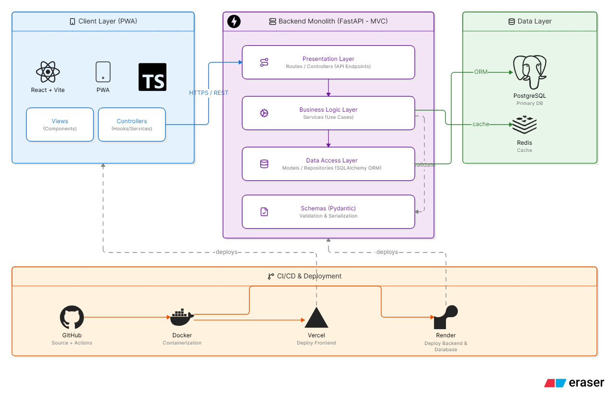

# VEYRA — Reporte de Estado Vehicular para Interventoras

VEYRA es una **Progressive Web App (PWA)** diseñada para optimizar los flujos de trabajo de inspección técnica vehicular para interventoras y contratistas. Como herramienta especializada, su formato PWA facilita la instalación y uso sin fricciones, brindando una experiencia rápida y confiable tanto en dispositivos móviles en campo como en escritorio.

The main goal is to replace paper-based inspection reports with a digital workflow, reducing the time spent filling out reports while providing full traceability across the entire vehicle lifecycle. This includes inspection history, maintenance records, and real-time fleet availability.

## Architecture

The application follows a **layered monolithic architecture** using the **MVC (Model–View–Controller)** pattern.

A modular monolith was intentionally chosen because it keeps deployment simple, reduces operational overhead, and allows the application to evolve without introducing the complexity of distributed systems prematurely. Responsibilities are clearly separated across layers, making the codebase easier to maintain, extend, and test as new business requirements come in.

> **Architecture Diagram**
>
> 

## Security

Since the application manages sensitive information about both employees and company vehicles, security was considered from day one.

The application follows common security best practices, including:

- Authentication and role-based authorization (RBAC)
- Secure password storage using one-way hashing
- Server-side input validation and data sanitization
- Protected sessions and authenticated routes
- HTTPS-only communication
- Principle of Least Privilege (PoLP)
- Secure handling of sensitive configuration through environment variables

These measures help ensure data confidentiality, integrity, and controlled access while keeping the application maintainable and production-ready.

> **Security Diagram**
>
>

## Preview
> **Login**
>
>
---
> **Dashboard**
>
>